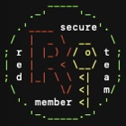

# RedSecurityStandart

## Info

Here you can find a List of RedSecurityStandartTeam members.

## What's the team?

RedSecurityStandartTeam is uses to certificate that program/site/... is secure and recomended for use by Red.

## Member list

| member-id | name | site |
| --------- |----- | ---- |
| rst-00000001 | RedNas | soon |
